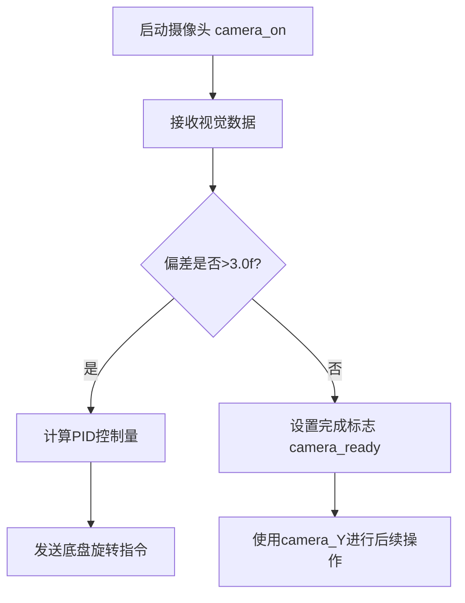

# Camera 模块使用说明

## 概述

Camera 模块是一个用于视觉追踪和控制的类，实现了以下功能：

- 接收摄像头数据并进行滤波处理
- 提供视觉锁定目标的 PID 控制
- 管理摄像头工作状态（暂停、启动、完成）
- 错误检测机制

## 文件结构

- `camera.h`：头文件，包含类声明和公共接口
- `camera.cpp`：源文件，包含具体实现

## 类成员说明

### 公共成员

```cpp
// 摄像头数据结构
struct {
    Vector2D vertial_plane_deviation; // 视觉平面偏差(x: yaw方向, y: pitch方向)
} camera_info;

bool gaze_flag = true;      // 目标检测标志
bool camera_ready = false;  // 视觉锁定完成标志
float camera_Y = 0.0f;      // 锁定完成时的Y坐标值
```

### 私有成员

```cpp
float lock_vol;             // 锁定控制电压
pid lock_basket_pid;        // 视觉锁定PID控制器
CameraMode camera_mode;     // 摄像头工作模式
```

### 枚举类型

```cpp
enum CameraMode {
    camera_suspend, // 暂停模式
    camera_start,   // 启动模式
    camera_finish   // 完成模式
};
```

## 主要方法说明

### 构造函数

```cpp
Camera();
```

- 初始化 PID 参数和错误代码

### 数据接收回调

```cpp
void DataReceivedCallback(const uint8_t *byteData, const float *floatData,
                         uint8_t id, uint16_t byteCount) override;
```

- **功能**：处理接收到的摄像头数据
- **参数**：
  - `id == 1` 且 `byteCount == 8` 时处理有效数据
  - 对数据进行滤波处理，限制突变幅度
- **数据格式**：
  - `floatData[0]`：x 方向偏差
  - `floatData[1]`：y 方向偏差

### 视觉锁定控制

```cpp
float lock_basket_vol();
```

- **功能**：计算视觉锁定所需的控制电压
- **返回值**：
  - 偏差 > 3.0f 时：PID 计算的控制电压
  - 偏差 ≤ 3.0f 时：0.0f（表示锁定完成）
- **副作用**：当锁定完成时设置：
  - `camera_Y = camera_info.vertial_plane_deviation.y`
  - `camera_mode = camera_finish`

### 摄像头控制

```cpp
void camera_on();  // 启动摄像头视觉处理
void camera_off(); // 停止摄像头视觉处理
```

### 主处理函数

```cpp
void process_data() override;
```

- **工作模式处理**：
  - `camera_suspend`：重置状态
  - `camera_start`：执行锁定控制
  - `camera_finish`：停止运动控制并设置完成标志

### 错误检测

```cpp
err_code check_error() override;
```

- **检测逻辑**：
  - 当接收到的数据为 `(-721, 540)` 时返回错误
  - 否则返回工作正常

## 使用示例

### 初始化配置

```cpp
#include "camera.h"

Camera camera;

camera.addport(&ros_port);
camera.add_chassis(&s3_chassis);

task_core.registerTask(9, &camera);//相机特殊控制频率

```

### 主循环处理

```cpp
void main_loop() {
    // 启动摄像头处理
    camera.camera_on();

    // 在任务管理中处理摄像头数据
    camera.process_data();

    // 检查错误状态
    if(camera.check_error() != ERR_CODE_WORK_SUCCESS) {
        // 错误处理逻辑
    }

    // 当视觉锁定完成时
    if(camera.camera_ready) {
        float target_distance = camera.camera_Y / 1000.0f;
        // 使用目标距离进行射击等操作
    }
}
```

## 注意事项

1. **工作模式切换**：使用 `camera_on()`/`camera_off()`控制视觉处理启停
2. **错误处理**：定期调用 `check_error()`检测摄像头异常
3. **滤波处理**：模块内置了数据突变限制（80 单位/周期）
4. 切换模式要注意使用 `camera_on()`/`camera_off()`，重置相关参数。（可以根据需求再做出更改）

## 典型工作流程


